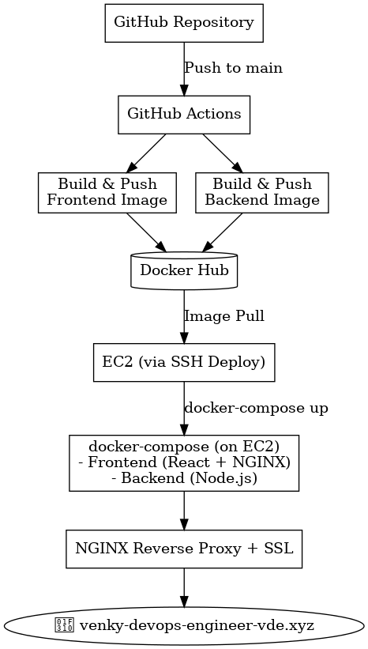
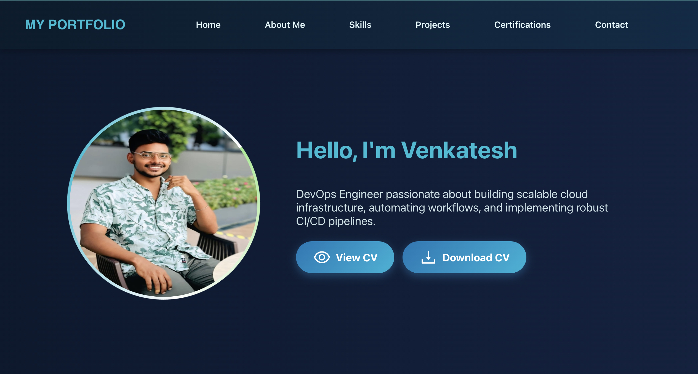
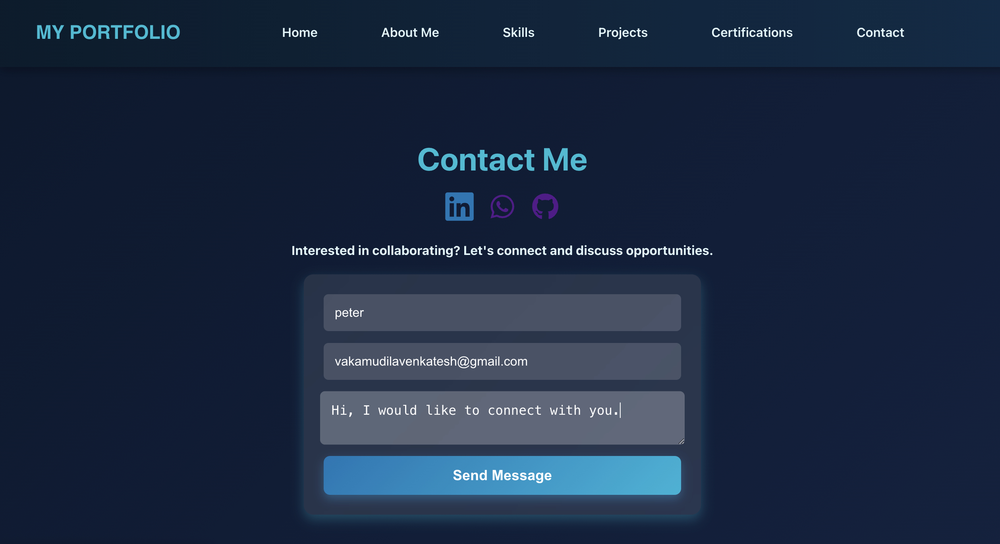
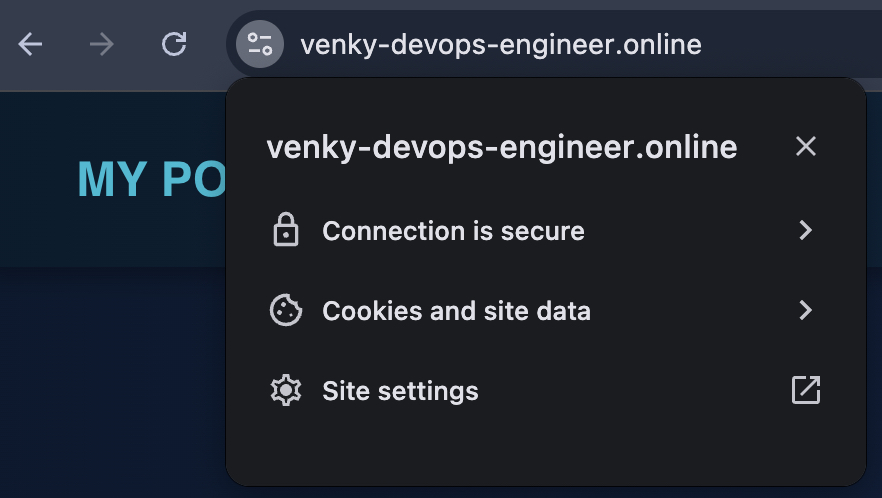

# 🚀 DevOps Portfolio Project

This is a **full-stack DevOps portfolio project** featuring a React frontend and Node.js backend, containerized using Docker, deployed using a GitHub Actions CI/CD pipeline, and hosted on AWS EC2 provisioned through Terraform. The project includes a custom domain with HTTPS support via Let’s Encrypt and NGINX reverse proxy.

## 📊 Workflow:


---

## 🌐 Live Demo

🔗 [https://venky-devops-engineer-vde.xyz](https://venky-devops-engineer-vde.xyz)

---

## 📸 Highlights 

| Homepage | Contact Page |
|----------|--------------|
|  |  |

| GitHub Actions CI/CD | SSL Enabled Site |
|----------------------|------------------|
|  |  |


---

## 🧱 Tech Stack

- **Frontend:** React.js, CSS
- **Backend:** Node.js, Express.js, Nodemailer
- **Containerization:** Docker (multi-stage builds)
- **CI/CD:** GitHub Actions
- **Infrastructure as Code:** Terraform
- **Web Hosting:** AWS EC2 (Ubuntu)
- **Web Server:** NGINX as reverse proxy
- **SSL Certificate:** Let’s Encrypt + Certbot
- **Domain Management:** GoDaddy

---

## 🛠️ Key Features

- ✅ Responsive and mobile-friendly portfolio website
- 📩 Fully functional contact form with Gmail auto-reply
- 🐳 Dockerized frontend and backend services
- 🔁 CI/CD pipeline for automated builds and deployment
- 🚀 Automatic deployment on push to the `main` branch
- 🔐 HTTPS enabled using Let's Encrypt and NGINX
- 📦 Multi-architecture Docker image builds (amd64 + arm64)
- 🧹 Automated cleanup of unused Docker resources

---

## 📂 Project Structure
```bash
my-portfolio/
├── .github/
│   └── workflows/
│       └── deploy.yml               
├── backend/
│   ├── Dockerfile
│   ├── server.js
│   └── package.json
├── frontend/
│   ├── Dockerfile
│   ├── src/
│   ├── public/
│   └── package.json
├── terraform/
│   ├── main.tf
│   ├── variables.tf
│   └── outputs.tf
├── docker-compose.yml             
├── README.md
└── images/  
```                  

## ⚙️ CI/CD Pipeline Flow

🚀 Code push to `main` triggers GitHub Actions  
🛠 GitHub Actions Steps:  
- Checkout the repo  
- Build frontend and backend Docker images with build args and secrets  
- Push images to Docker Hub  
- SSH into EC2  
- Clone the latest repo  
- Create `.env` files using GitHub secrets  
- Pull updated Docker images  
- Restart containers using Docker Compose  
- Prune unused Docker images and volumes  

---

## 🔐 HTTPS & NGINX Configuration

NGINX acts as a reverse proxy:  
- `/` → React frontend (running on port `3000` inside container)  
- `/send` → Node.js backend (running on port `5001`)  
- SSL configured using **Certbot**  
- Auto-renewal enabled via **cron**  
- **Domain**: `venky-devops-engineer-vde.xyz`  

---

## 🧠 Learning Outcomes

- Set up full CI/CD with GitHub Actions  
- Docker multi-arch image builds using `buildx`  
- End-to-end infrastructure automation with **Terraform**  
- Hands-on experience with **domain + SSL + reverse proxy using NGINX**  
- Containerized full-stack application architecture  

---

## 🤝 Connect with Me

- **GitHub**: [https://github.com/VenkateshV14](https://github.com/VenkateshV14)  
- **LinkedIn**: [https://www.linkedin.com/in/venky-venkatesh](https://www.linkedin.com/in/venky-venkatesh)  
- **Email**: [petercephas52@gmail.com](mailto:petercephas52@gmail.com)
